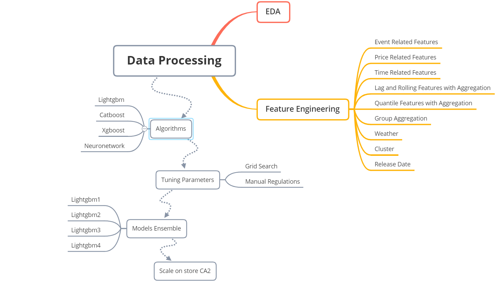
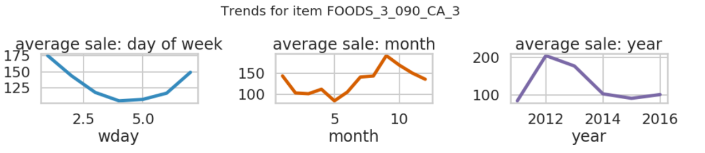

M5-Forecasting Accuracy Report

Authors:

Qingwei Meng: webermeng\@gmail.com

Wenyin Gu: wenying.gu\@vanderbilt.edu

Liyang Chen: smylc1\@gmail.com

Hai Guo: guohaidsg\@gmail.com

Jingyu Wang: captaindadwang\@gmail.com

[Introduction](#Introduction)

# Introduction

The M5 Forecasting-Accuracy Competition, held by The Makridakis Open
Forecasting Center and Kaggle Platform, uses hierarchical sales data
from Walmart to predict Walmart's daily sales for the next 28 days. The
data covers ten stores in California, Texas, and Wisconsin and includes
variables such as item level, department, product categories and store.
Various explanatory variables such as price, promotions, day of week and
special events are also included and enable for a robust dataset to be
generated, and for forecasts to be more accurate.[^1] Figure 1 shows the
structure of the data.[^2]

> 
> 
 Figure 1. 

This competition has two stages. During the first stage of the
competition, competitors are able to use the data, known as the public
dataset, from between days 1-1913 to make predictions about daily sales
between days 1914 -1941. For the second stage of the competition, data
is released relating to sales between days 1914-1941, the private data
set. The goal for this competition is to predict the results from day
1914 to 1969.

This competition uses Weighted RMSSE (WRMSSE) as the evaluation metric,
according to the following formulas:

  

With *t* being a point in the generated forecast, *n* the length of the
training sample (number of historical observations), and *h* the
forecasting horizon.[^3]

There are 42840 series in aggregate. A lower WRMSSE score is better. In
this competition, our team earned 534^th^ place out of a total of 5598
teams with a final score of 0.69398. During our two-month preparation we
undertook EDA and feature engineering. We utilized many techniques and
frameworks, including Lightgbm, Catboost, Xgboosts, Neural network and
Agglomerative Clustering. We tuned parameters and applied
cross-validation to minimize overfittings.

 Figure 2. Workflow

# EDA

Explanatory Data Analysis, or EDA for short, refers to utilizing various
techniques to maximize insights that can be gleaned from a dataset. The
boxplots below, aggregating data from all 10 stores, show total sales of
10 stores by department and by category.

  

 Figure 3. Total Sales by Department and by Category 

As can be seen in the first boxplot, the Foods_3 category far outsells
the product categories in the food category, as well as the various
categories in other departments. As can be seen in the second boxplot,
the foods category has the highest sales of any of the three goods
categories. The higher total sales of food items relative to other items
may be the result of high sales of Foods_3 items. The non-uniform
distribution of sales between departments mean that we ought to sort the
data by department when developing models.

Notice in the below figure that all ten Walmart stores in the dataset
sell the same seven categories of items across the three broad item
categories.

  

 Figure 4. 

The heat map above tells us that the number of items by department is
the same between these stores. The regression plot shows that the number
of items in each department and the mean total sales by department are
independent; the number of items in each department does not
significantly affect the department's aggregate sales. This means that
we do not need to pay much focus to the number of items in each
department in our later models.

Although the number of items in each category for each store is uniform,
different stores have different selling prices for their various items.
Furthermore, the price of items grows as time passes. The following
boxplots reveals the relationship between sales and states and between
sales and stores.

 Figure 5. Distribution of prices for different item categories between stores 

  

 Figure 6. Total sales by various 

Since, as we can see, mean sales in stores in CA are not significantly
higher than in other states, it is plausible to conclude that higher
aggregate sales recorded in CA are caused by the fact that the state has
one more store in the dataset (four) than the other states, which both
have three. While CA_3 made the most sales of any store in the dataset,
store CA_2's sales were similar to those of other stores, and the sales
of CA_4 were, by the standards of other stores, relatively low.
Therefore, the higher mean sales in CA result from CA_3's exceptionally
high sales. The distributions of sales by store and sales by state
incline us to split the data by store and by state when we produce
models.

FOODS_3\_090_CA_3, to name one random item, appears to have rather high
sales prices.

  

 Figure 7. A random item's daily sales changes 

We can see that this item was taken off the shelves for a while in the
first year. Then it became available again and kept selling at a high
rate until the third year. Also, the annual sales volume shows a
fluctuating trend over years. These findings provide some ideas for
further feature engineering.

To further explore those fluctuating trends, we merged the historical
daily unit sales data per product and store with the calendar data to
have additional information about the dates. From this, we were able to
track weekly and seasonal trends more accurately. For the random item
described in figure 7, sales for it are higher on weekends because
people were more likely to go to the store and purchase it on these
days. Different months of the year also appeared to have a significant
impact on sales, indicating that the weather may have affected sales.

 Figure 8. 

Some other items are randomly selected for exploration and comparison.
Their sales were influenced by the weekend and seasons much like how
they were for the item described in figure 7, however trends between
these items, we can see, were not consistent.

 Figure 9. Sales trends of specific items over particular periods 

We studied sales trends of random items to explore our data from a
macroscopic perspective. One way to do this was to look at sales
differences for items between categories and stores. Generally, each
Walmart has seven departments, with three major categories of goods
between these departments. The categories are Food, Hobbies and
Household. As shown in the figure below, food has long been Walmart's
main source of revenue followed by household and then hobbies. Food
items experience unique sales peaks while household and hobbies items
have similar peak times.

 Figure 10. 

For a better understanding of the trends under a particular category,
we generated calendar heat maps like the ones
following.

  

 Figure 11. 

  

 Figure 12. 

  

 Figure 13. 

As can be deduced from a look at the above heatmaps, weekends comprised
the most popular shopping days for customers regardless of the item
category. Food purchases also tended to decrease in volume over the
course of each month. Household and Hobby items sold much less in
January, implying that Walmart customers are less likely to spend money
on these items so soon after the Christmas and New Year holiday season.

Following figure plots a rolling 7-day total sales count by store. Some
stores experienced abrupt changes in their sales. This suggests that we
need to take these unusual sales changes into account when we make
predictions.

 Figure 14. 

# Function Engineering

## Event related functions

We found that during certain periods some items sold significantly more
than during usual times. Therefore, we were careful to factor certain
events into our calculations, and to track changes in item sales within
seven days of an event either taking place, or having taken place.
Certain NBA games, to take one example, exert a significant impact on
food sales, so were factored into account.

## Price related functions

We grouped data by their store IDs and item IDs to calculate sale price
maximums, minimums, standard deviations and means. In EDA, we found that
some items' prices are inflation dependent, while others are stable. We
distinguished them by adding the price_nuinque feature, which counts the
number of unique values each item has. Then we used months and years as
windows to do rolling aggregations. Lastly we added the price_momentum
feature, which provides a ratio of prices for one week divided by, for
example, prices in a previous week, or the average price of each month,
or the average price in a year.

## Time related functions

We factored into account the fact that the year, month and day, and
whether a day falls on a weekend or not, can exert an influence on an
item's sales. We also introduced is_first_half_month as a variable, as
the time of month influences the sales of many items.

## Lag and Rolling functions with aggregation:

We used Lag and Rolling factors to show the trends of item sales. We
first created lags by shifting sales data downwards by between 28-42
days. This introduced lag into our calculations. Then we shifted the
sales for 28 days and rolled the data with window sizes seven, 14, 28,
56 and 168 with mean and standard deviation functions. Next, we shifted
data for one, seven and 14 days. For each day that we shifted, we rolled
the data with window sizes seven, 14, 28 and 56 days applied with the
mean function.

## Quantile Functions with aggregation:

This idea comes from [[M5 Forecasting -
Uncertainty]{.underline}](https://www.kaggle.com/c/m5-forecasting-uncertainty).
We added this function because it made our predictions better. We chose
28 days for the size of our windows. For each window size, we shifted
data for 28 days, and selected quintiles of 97%, 87.5%, 50%, 22.5%, 3%
for the window. We applied mean function as the aggregation function for
each window.

## Group Aggregation

We used this function because it allowed us to see the average sales for
all 12 levels. This feature groups data based on their state ID, store
ID, category ID, department ID, state ID and category ID, state ID and
department ID, store ID and category ID, store ID and department ID,
item ID, item ID and state ID. Then we found their means and standard
deviations.

## Weather

Some items, such as sleds, have sales that are strongly influenced by
the weather. We used weather information on
<https://zh.weatherspark.com/> to record general weather information for
each month, assigning values ranging from 0--8 to describe temperatures,
monthly rainfall volumes, amounts of snow, and the average of highest
temperatures for each month. The functions were termed
\'temperature_high\', \'temperature_con\', \'rainfall_m\', \'snow_m\'.

## Cluster

As we saw from our EDA, item sales for certain items exhibited similar
trends between days 1-1913. Notably, the sales numbers of some of these
items had many zeros at the front of them. We used Agglomerative
Clustering with four clusters to group data. This algorithm treated
every data point as a cluster, then began merging clusters with the
minimum distances between them until only four clusters remained.

  

 Figure 15. 

The data in Cluster 0 have zero sales for the first 250 days; Data in
Cluster 1 have 0 sales for the first 750 days. Data in Cluster 2 have
sales from day 1. Data in Cluster 3 have 0 sales for the first 1000
days. Then for the data in Cluster 0, we drop the first 250 days. For
the data in Cluster 1, we drop the first 750 days and so on.

## Release Date

Release date is the first week when the item has a sales price. We
acquired the release date for each item from the calendar and dropped
the rows with dates from before the release date.

# Models

## Lightgbm

Lightgbm is a gradient boosting framework that uses a tree-based
learning algorithm. Compared with other level-wise tree models, when
growing the same leaf, Lightgbm grows the tree leaf-wise, resulting in
less data being lost than in comparable algorithms. This feature of
Lightgbm makes the algorithm efficent and distributed. Lightgbm has a
faster training speed and is more efficient than other algorithms.
Furthmore, it can handle large-scale data while consuming relatively low
amounts of memory. The main reason why people prefer this algorithm is
that Lightgbm provides better accuracy in its results. Additionally,
Lightgbm supports parallel and GPU learning which also contributes to
making it more widely used.

### Before Training:

We first removed ID, state ID, store ID, date, wm_yr_wk, and d features.
We removed the cluster feature because we only used it for removing
outliers. We deleted rolling with quantile features because they did not
contribute a lot in Lightgbm. We also the deleted the snow_m feature for
stores in CA and TX because little to no snows falls in those states.

### Parameters:

  **Parameters Types**   | **Parameters**         |**Explanation for Parameters**                     
  -----------------------| -----------------------|-----------------------
  Boosting Type          |gbdt                    |Not "goss" because it causes high overfitting. "Dart" is good except that it is too slow.            
  objective               |Tweedie Loss Function  |Our data have many 0's. Tweedie is effective at tackling data with  excessive zeros
  Tweedie Variance Power  |1.1                     |Determining the penalty of error when data get close to 0. For example, suppose one prediction is 0.2 while its label is 0.3.  Another prediction is 0.1 but its label is 0.  Even though the absolute error are 0.1 in both cases, the  error given by Tweedie. Regression to the second case would be much larger than the first one. Less Tweedie Variance Power means higher penalty when data gets close to 0.
 metric                  |RMSE                     |Close to WRRMSE
  subsample               |0.5                     |Controlling overfitting
  subsample frequency     |1                       |Controlling overfitting
  learning rate           |0.03                    |A conventional value
  number of leaves        |2\*\*11 - 1, min_data_in_leaf: 2\*\*12 - 1           |Controlling overfitting while forcing the trees to reach one of the limits above
  n estimators           |1400                    |Number of trees the   model constructs. We chose this by our experience                                                
 feature fraction        |0.5                     |Proportions of features used for training each tree. This controls overfitting
  boost from average    |FALSE                   |  
### Training Methods:

We trained the model by stores. We got the data by their store IDs
first. Our training data were for the first 1913 days. Our data for
validation were for the last 28 days. We used the future 1 to 28 days as
our test data set.

### Training Results:

The average ten most important features are shown below:

Mean rank refers to features' mean rank for the ten stores. The rolling
features with the aggregation function mean seemed the most influential
feature.

### Predicting Methods

As we were predicting 28 days and there were trends in our data, we used
a recursive method that predicted the next day based on previous
predictions and known data.

## Xgboost

Xgboost is a well-known gradient boosting model. It is able to control
overfitting through its advanced tuning features. The capable performing
of normal gradient boosting, stochastic gradient boosting and
regularized boosting make it a more formalized model which avoids
overfitting effectively. However, Xgboost has an execution time that is
5-6 times slower than Lightgbm.

### Before Training: 

We removed the following features: ID, state_id, store_id, date,
wm_yr_wk, d, Target, and cluster. We also encoded all categorical
features to numeric features.

### Parameters: 
  **Parameters Types**   | **Parameters**         |**Explanation for Parameters**                     
  -----------------------| -----------------------|-----------------------
  Boosting Type          |gbtree                  |Dart too slow and gblinear for linear models          
  objective               |Tweedie Loss Function  |Same as Lightgbm
  Tweedie Variance Power  |1.1                    | Same as Lightgbm 
 metric                  |RMSE                    | Close to WRRMSE
  subsample               |0.5                     |Same as Lightgbm
  subsample frequency     |1                       |Same as Lightgbm
  learning rate           |0.03                    |Same as Lightgbm
  lambda                  |0.1                     |Optimized result from grid search
  number of leaves        |2\*\*11 - 1,            |Controlling overfitting
  Hessian                 |2                      |Controlling overfitting by limiting the weight in each leaf. 2 is acquired from grid search
  n estimators           |1400                    |Same as Lightgbm                                                
  colsample bytree       |0.5                     |Proportions of features used for training each tree. This controls overfitting

### Training Methods:

This is similar to Lightgbm.

### Predicting Methods:

Similar to Lightgbm.

## Convolutional Neural Network

Convolutional Neural Network (CNN) is a type of deep neural network,
which has multiple neuron layers between input and output layers. While
CNN possesses advantages, such as minimizing computation by more
accurately grasping the essence of data compared to regular neural
networks, it has a tendency to underfit or overfit. Tuning parameters
within it is also an arduous and ineffective process. It also takes long
time to produce a CNN model. Overcoming all these hurdles, we designed
our optimized CNN model as follows: we first removed ID, state_id,
store_id, date, wm_yr_wk, d, and event_attention_sum features. Since CNN
cannot automatically handle categorical values or missing values, 15
categorical features were transformed into embedding inputs and
concatenated with other numerical features. We used a 5-layer model,
with each layer having 256, 128, 64, 16, 4 filters with the "Relu"
activation function, and one linear layer for output. The loss function
was the mean square error. The learning rate was 0.0002. Batch size was
2 to the 14th or 16384, and epoch was 70.

## CatBoost

Catboost, like Xgboost and Lightgbm, is a machine learning algorithm
that uses gradient boost on decision trees. Although Catboost has
advantages such as dealing with categorical data more efficiently than
other boosting methods and not requiring conversion of datasets into
specific formats, using Catboost with large datasets is a relatively
slow process compared with using Lightgbm.

### Before Training 

First, we remove ID, state_id, store_id, date, wm_yr_wk, d, and
event_attention_sum features. For null values in categorical features,
we fill them with "missing", and for those in numeric features, we fill
them with -9999 to distinguish them from other values. Then we encoded
all categorical data.

### Parameters:
  **Parameters Types**   | **Parameters**         |**Explanation for Parameters**                     
  -----------------------| -----------------------|-----------------------
  Iteration              |1400                    |Same as Lightgbm          
  verbose                |0                       |
 metric                  |RMSE                    |Same as Lightgbm
  boosting_type          |plain                    |Classic gradient boosting scheme
  learning rate           |0.03                    |A conventional value
  feature fraction        |0.5                     |Same as Lightgbm
  depth                   |11                      |Same depth as Lightgbm
  border_count            |100                     |The number of splits for numerical features                                            
  boost from average     |FALSE                   |  

### Training Methods:

Similar to Lightgbm.

### Predicting Methods:

Similar to Lightgbm.

### Split strategies

The split strategies are based on EDA. We split our data by stores, by
departments, by states and categories, and by clusters. Then we cross
validated with three folds for each component.

# Final Submission

Our final submission comprised the collation of our four models with
different weight strategies and features. After trial and error, we
decided only to use Lightgbm, and to split data by stores, because other
methods did not improve our scores in the first stage of calculation.
Then we only performed cross validation on certain stores because only
certain stores had improved scores in the first stage of calculation.
Then the results from our cross-validations were substituted into the
results from four Lightgbm models.

# Models

## Model 1

We used Lightgbm as outlined above. We first collated and predicted
using the entire dataset. We did cross validation for CA1, CA2, CA3 and
WI1 with three folds.

## Model 2

This was similar to model 1 except that before training, the weight for
item from year 1 was 0.88; for year 2 was 0.91; for year 3 was 0.94; for
year 4 was 0.97; for year 5 was 1, and for year 6 was 1.03. The
increment of 0.03 each year came from the average rate of sales
increases for all of Walmart each year, as stated in a financial report
issued by Walmart. We did cross-validations for CA1, CA2, CA3 and WI1
with three folds.

## Model 3

Similar to Model 1 except that the weight of each item came from its
sales price. We did cross-validations for CA1, CA2, CA3 and WI1 with
three folds.

## Model 4

Similar to Model 1 except that we added quantile features in our
collating and validating data. We did cross-validation for CA1, CA2, CA3
and WI1 with three folds.

## Scaling on CA2

Each item's daily sales prediction in CA2 were divided by the total
sales of the day.

## Ensemble

We take average of the results from four Lightgbm models as the final
submission.

## Review

We overfit the public dataset because we got 0.46 for public dataset
while our final score was around 0.7. This was because our trial and
error focused too much on the public dataset. Furthermore, we added too
many features in order to fit the public dataset
well.

[^1]: ^1^
    [[https://www.kaggle.com/c/m5-forecasting-accuracy]{.underline}](https://www.kaggle.com/c/m5-forecasting-accuracy)

[^2]: THE M5 COMPETITION Competitors' Guide

[^3]: ibid
